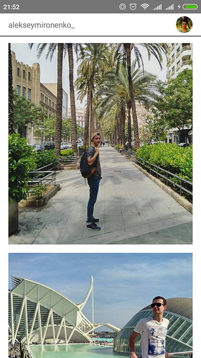

## Photoflow

It's my demo app using React-Native technology.

You can find it in [my Expo profile](https://expo.io/@alexmarvelo/photoflow).

Application can load your recent photos from Instagram account and display them in the list.

This project was bootstrapped with [Create React Native App](https://github.com/react-community/create-react-native-app).

